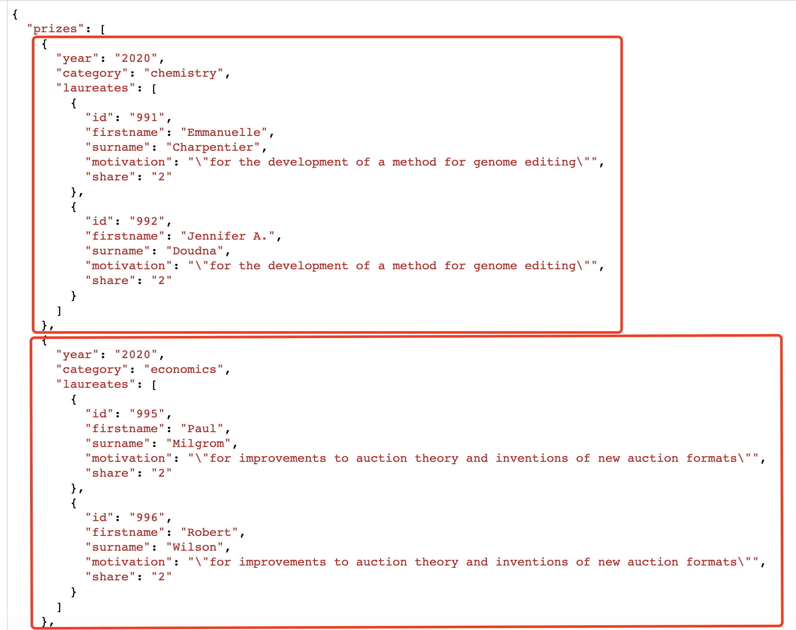

# Nobel Prizes
## About this project
This project created a program to query and filter a collection of Nobel prize winners in different ways such as by **year** or by **category**. The data behind includes Nobel Prize history for years between 1901 to 2020.

The files included are:
- `prize.json` -- main data source stored as **JSON** format.
- `nobel.py` -- main program executed to realize the functionalities.
- `helper.py` -- auxiliary program to help parse the arguments from command line.
- `country.json` -- a uniformed data source for **country names** and their corresponding **country code**.

---
## How It Was Built

To accomplish these functionalities, we have gone through two main steps:
1. Read and parse the data.
2. Establish the filtering mechanism.

First, we defined a function called `load_nobel_prizes` to read the data into the workspace. The data are stored as `json` format. (See as below.)

```
def load_nobel_prizes(filename='prize.json'):
    pass
```



<br>

Secondly we defined another function called `main` to parse the data and establish the filtering mechanism.

```
def main(year, category):
    data = load_nobel_prizes()
    ...
```

Specifically in this function, we considered three cases:
- ___CASE 1___: The `laureates` does not exist for some year/category.
- ___CASE 2___: The input `year` is not null but does not match the `year` key.
- ___CASE 3___: The input `category` is not null but does not match the `category` key.


When you run the `nobel.py` in the **terminal**,this program will print out information about Nobel prizes based on the filtering condition you'd like to set. 
- If a `year` is specified (not None), it only prints out information about those Nobel prizes from that **specified year**. 
- If a `category` is specified (not None), it only prints out information about those Nobel prizes from that **specified category**.
- If neither the `year` nor `category` is specified, it prints out all the prizes throughout the history.

---
## Examples
This program is executed in the terminal with command line with arguments determined by a parser in the `helper.py` module. You can run as follows,

**Scenario 1:** It will print out all the information about the prize throughout the years.
```
$ python3 nobel.py
```

**Scenario 2:** It will print out all the information about the prize only in a **specified year**.
```
$ python3 nobel.py --year 2020
```

**Scenario 3:** It will print out all the information about the prize only in a **specified category**.
```
$ python3 nobel.py --category Physics
```

**Scenario 4:** It will print out all the information about the prize only in a **specified year** and a **specified category**.
```
$ python3 nobel.py --year 1901 --category Economics
```
The `year` and `category` are assigned by means of command-line flag, e.g. `--year 2020`.

## References
Your can refer to the prize data from [here](https://api.nobelprize.org/v1/prize.json).